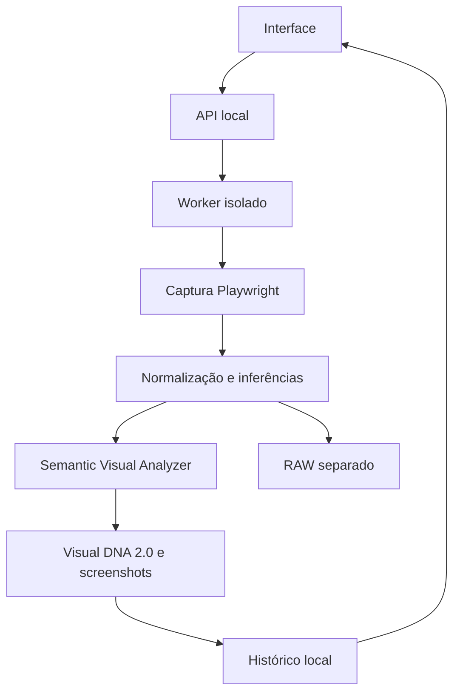

# VisDNA

**Observe. Entenda. Crie algo novo.**

Aplicação local que observa e interpreta a linguagem visual de páginas públicas ao longo do scroll, combinando DOM renderizado, **computed styles**, geometria, estados responsivos e mudanças visuais. O percurso progressivo inclui screenshots segmentadas e observação de estados visuais de canvas, dentro dos limites de captura. O resultado é um Visual DNA JSON versionado, independente do framework de origem. Não recupera o código-fonte de React, não copia stylesheets inteiras e não gera clones.

## Status desta entrega

Captura progressiva de páginas inteiras implementada incrementalmente sobre o Semantic Analyzer V2. A interface está em PT-BR e oferece apenas artefatos verificados pelo backend. O resultado separa DOM, scroll, captura visual e movimento, com segmentos para páginas longas, controles temporais de canvas e observação mobile limitada. Visual DNA 2.0 e RAW permanecem separados e registros V1 continuam legíveis. Consulte `docs/VERIFICATION.md` para testes e a validação real do Hungry Tiger. Não trate esta entrega como certificada para produção.

## Requisitos

- Node.js 22 ou 24 LTS, npm e acesso à internet para instalação.
- Windows 10/11, macOS ou Linux compatível com Playwright.
- No Linux, uma sessão **sem root**, com suporte ao sandbox do Chromium. Não use `--no-sandbox`.
- Recomendado: 4 GB de RAM disponíveis. A aplicação executa uma análise por vez.
- Não exige API key, IA externa, banco remoto ou Docker.

## Abrir no VSCode e executar

Extraia o ZIP, abra a pasta **visdna** (a que contém `package.json`) e use o terminal integrado:

```powershell
npm ci
npm run browser:install
npm run dev
```

Abra **http://localhost:4173**. Cole uma URL pública completa (`https://...`), clique em **Analisar site** e aguarde as etapas reais recebidas do backend. Na conclusão, explore as abas e baixe o JSON em **Baixar DNA Visual**.

Linux: se faltarem bibliotecas nativas, execute `npx playwright install --with-deps chromium` durante a preparação do sistema. A aplicação em si deve continuar executando sem root.

Build e execução sem o carregador TypeScript:

```powershell
npm run build
npm start
```

Execute os comandos na raiz do projeto: os caminhos de `web/` e `data/` são relativos ao diretório atual.

## Stack e arquitetura

- Backend: Node.js, TypeScript estrito, Express 5, Zod.
- Navegador: Playwright + Chromium com sandbox, contextos descartáveis.
- Análise: funções TypeScript puras, separadas da coleta.
- Interface: HTML, CSS e JavaScript ES modules, sem framework ou etapa extra de bundling.
- Persistência: arquivos JSON locais com escrita temporária + rename, screenshots PNG e segmentos JPEG por análise.
- Testes: runner nativo `node:test`; ESLint, TypeScript e Prettier.



O frontend nunca recebe HTML original para executá-lo. A automação recebe recursos através de um transporte próprio com IP validado; tráfego não interceptado encontra um proxy local que recusa conexões. O worker é encerrado no prazo máximo, junto com sua árvore de processos.

## Estrutura

```text
src/
  server.ts                 API, validação, fila de capacidade 1 e ciclo de vida
  worker.ts                 coordenação da captura e análise
  process.ts                encerramento da árvore de processos
  types.ts                  contratos V1/V2 e modelos de captura
  security/url.ts           validação de URL, classificação de IP e DNS
  security/fetch.ts         conexão ao IP validado, TLS e limites
  browser/engine.ts         navegação, screenshots, scroll e viewport mobile
  browser/collect.ts        coleta seletiva no DOM
  analysis/normalize.ts     cores, frequências e agrupamento de espaçamentos
  analysis/components.ts    inferências estruturais com evidência
  analysis/raw.ts           diagnóstico técnico e candidatos preservados
  analysis/semantic/        inferências com evidências e tokens V2
  analysis/dna.ts           separação RAW / Visual DNA 2.0
  storage/store.ts          persistência, recuperação e retenção
web/                        interface estática responsiva
tests/                     testes e página de referência controlada
 docs/                      segurança, contrato e verificação
```

## Funcionalidades implementadas

- URL pública com validação e erros sem stack traces na UI.
- Coleta de cor, fundo, gradiente, fonte, tamanho, peso, altura de linha, tracking, bordas, raio, sombra, opacidade, filtros, dimensões, alinhamentos, grid/flex, espaçamentos, animações e transições.
- Amostragem de até 1.800 elementos visíveis e inspeção limitada a 12.000 nós.
- Paleta com contagem e frequência; cores RGB/RGBA/hex normalizadas, transparência preservada.
- Cores modernas comparadas em OKLab, clustering perceptual e cobertura estimada de fundos, separada de frequência. Papéis com evidência/confiança; campos sem evidência são `null`, inclusive success/warning/danger.
- Escalas de tipografia e espaçamentos; espaçamentos em px agrupados no múltiplo de 2 mais próximo.
- Containers e regiões semânticas; grids/flex e candidatos técnicos completos permanecem no RAW.
- Navbar, hero conservador, botão, input, form, FAQ, footer e famílias de cards com anatomia e referências a tokens.
- Transições/animações declaradas e mudanças de transform, opacity e filter em até 20 checkpoints adaptativos.
- Desktop 1440×900 e mobile 390×844 com até 6 checkpoints próprios; coleta acumulada e IDs estáveis por objeto DOM.
- Screenshot principal/mobile PNG; segmentos JPEG para páginas longas. Imagem integral opcional continua limitada a 12.000 × 2.400 px.
- Canvas explícito no RAW; diferenças RGB em amostras de 16×16 pixels e observações sem scroll, sem IA ou extração de WebGL.
- Abas Visão geral, Cores, Tipografia, Espaçamento, Bordas, Sombras, Componentes, Layout, Movimento e DNA Visual bruto.
- Histórico compatível com V1, download Visual DNA V2 e RAW separado na Visão geral; retenção existente preservada.

Não coleta textos, logos ou arquivos de imagem para reutilização. **Screenshots contêm a aparência e o conteúdo visível da página**, como solicitado; ficam no armazenamento local, não são incorporados ao JSON exportado.

## Progresso e erros

O worker publica etapas reais. A interface consulta o estado a cada 650 ms: fases rápidas podem ser concluídas entre consultas e não aparecer individualmente. O tempo exibido representa o período de acompanhamento na tela, não uma porcentagem estimada.

URL inválida, rede privada, falha DNS, HTTP 4xx/5xx, SSL/rede, timeout, bloqueio de acesso e falha no Chromium retornam mensagens seguras. Recursos secundários indisponíveis geram avisos quando a página principal ainda pode ser analisada. Páginas com pouco conteúdo falham explicitamente. Detecção textual de CAPTCHA/verificações é heurística e pode ter falsos positivos; não há tentativa de contorná-las.

## Configuração

Não é necessário criar `.env`. Há um `.env.example` com:

| Variável      | Padrão | Finalidade                                                     |
| ------------- | ------ | -------------------------------------------------------------- |
| `PORT`        | `4173` | Porta HTTP; bind sempre em `127.0.0.1`.                        |
| `VISDNA_DATA` | `data` | Diretório de histórico e screenshots; aceita caminho absoluto. |

Para usar um arquivo `.env`, copie `.env.example` e inicie o build com:

```powershell
node --env-file=.env dist/src/server.js
```

O script `npm run dev` não carrega `.env` automaticamente. No PowerShell também é possível definir `$env:PORT="4174"` antes de executar. Não há segredos obrigatórios.

## Armazenamento e privacidade

Cada análise tem UUID, URL, domínio, data, status, DNA e imagens. São mantidas até **30 análises por até 7 dias**, com limpeza na inicialização, na conclusão e de hora em hora. Trabalhos interrompidos são marcados como erro na reinicialização. Para apagar tudo, pare a aplicação e remova `data/`.

Sem telemetria e sem envio a modelos de IA. O site analisado recebe requisições identificadas como `VisDNA/1.0`; o coletor não reutiliza sessões, cookies, credenciais ou perfis pessoais. URLs completas ficam no histórico: evite URLs com tokens de acesso.

## Testes e qualidade

```powershell
npm run lint
npm run typecheck
npm test
npm run build
npm run test:api
npm run test:e2e
```

Os testes unitários não dependem de um site externo. Os testes E2E usam `tests/fixture.html`, servida por um transporte **injetado somente no teste** sob `https://fixture.example/`. A API não possui modo para ignorar SSRF, nem aceita arquivos HTML ou URLs locais.

O E2E verifica computed styles, cor, fontes desktop/mobile, cards, movimento, screenshots, página longa, conteúdo lazy, canvas estático/temporal/reativo e ausência de links para artefatos ausentes. Há teste de redirecionamento para loopback. O teste exige que o navegador tenha lançado antes de considerar a proteção verificada, evitando falsos positivos por falta de Chromium.

O lint cobre o TypeScript do backend e testes. O JavaScript da interface também foi validado sintaticamente com `node --check web/app.js`. O build compila backend e testes; a UI é servida diretamente de `web/`.

## Segurança

Leia `docs/SECURITY.md` antes de ampliar o escopo. As proteções incluem:

- Apenas HTTP/HTTPS, portas 80/443, sem credenciais na URL.
- Bloqueio de IPs privados, loopback, link-local, multicast, reservados, IPv4 mapeado em IPv6 e nomes internos.
- Validação de **todos** os endereços retornados pelo DNS e conexão ao IP já validado, preservando Host, SNI e validação do certificado.
- Revalidação em cada recurso; redirects passam pelo mesmo transporte, com teto conservador de 12 respostas de redirecionamento por análise.
- Tráfego do navegador que escapa da interceptação falha no proxy de negação; WebSockets e service workers bloqueados.
- Somente GET, sem downloads aceitos, pop-ups, permissões, mídia ou sessões pessoais.
- Limites de requests, bytes, DNS, navegação, duração e amostragem; um worker por vez.
- Bind loopback, Host/Origin restritos, CSP e nenhuma renderização de HTML extraído.

**Escopo: ferramenta local de uso individual.** Não publique este servidor na internet como está: falta autenticação multiusuário e isolamento de egress/memória em nível de sistema operacional. Limitar o heap JavaScript não limita toda a memória do Chromium. Docker não foi incluído: um container sem perfil correto de sandbox e egress criaria uma falsa sensação de proteção.

## Limitações conhecidas

- E2Es cobrem captura, segurança de redirecionamentos, warnings e todas as abas V1/V2. Resultados semânticos ainda exigem julgamento humano; ver `docs/VERIFICATION.md`.
- O navegador executa JavaScript público para obter estilos reais. Páginas hostis continuam exigindo atualização do Chromium e isolamento de sistema operacional para uso em escala.
- A V2 suporta rgb/rgba/hex/hsl, lab/lch, oklab/oklch e perfis selecionados de `color()`. Sintaxes relativas, `calc()`, componentes `none` e perfis não suportados ficam apenas no RAW.
- Pseudo-elementos, conteúdo interno de iframes, shadow DOM fechado e canvas não são decompostos.
- Não faz crawling de links, interações com menus ou hover, login, CAPTCHA, paywall, consentimento ou desafio antibot.
- Sem uso de cookies, alguns sites não se comportam como numa sessão normal; o coletor rejeita respostas comprimidas que ignorem `Accept-Encoding: identity`.
- Recursos acima dos limites, fontes indisponíveis e scripts que exigem POST podem alterar a captura.
- Fontes são identificadas pela declaração CSS. A interface usa fontes instaladas localmente; não redistribui fontes da referência.
- Cores têm frequência e estimativa de cobertura de fundos numa grade de caixas, sem análise pixel-perfect ou composição de transparência. Raios extremos são normalizados para cápsula/círculo segundo a geometria; valores originais permanecem no RAW. Não há clustering perceptual de sombras.
- Pricing e depoimentos não são inferidos sem evidência confiável; logo cloud e bento usam sinais estruturais conservadores. Rótulos ausentes não significam ausência do padrão na página.
- Correspondência desktop/mobile usa identidade do objeto DOM, tag, pai e role; nós substituídos não são equiparados automaticamente. Reduções tipográficas improváveis ficam desconhecidas. Não infere breakpoints exatos.
- Checkpoints são limitados por quantidade e tempo, sem teto fixo de altura. Páginas muito altas, infinitas ou que se reorganizam podem ter lacunas explícitas. Chegar ao fim não equivale a observar 100%.
- O canvas é observado visualmente, não decomposto. Diferenças podem refletir recortes, oclusão ou passagem do tempo. Controles temporais sustentam associação com scroll, sem provar causalidade.
- Sem cota de memória nativa rígida; limite de duração e árvore de processos são salvaguardas, não substitutos de cgroups/Job Objects de produção.

## Evolução planejada

Comparação e combinação de DNAs; tokens exportáveis; geração React/Tailwind; classificação mais refinada; normalização perceptual de cores modernas; captura por interação; correspondência DOM robusta; integração com IA e testes de similaridade. O contrato versionado e a separação entre captura/análise/exportação permitem essas extensões sem acoplar ao framework da referência.

## Troubleshooting

- **Executable doesn't exist:** rode `npm run browser:install` na mesma conta usada para executar o app.
- **Sandbox failed / running as root:** use uma sessão normal no Windows/macOS ou usuário sem root no Linux. Não altere `chromiumSandbox: true`. Containers podem exigir um perfil de sistema específico.
- **Porta ocupada:** altere `PORT` ou pare o processo existente.
- **URL interna rejeitada:** comportamento intencional, inclusive `localhost`. Para testar o motor use `npm run test:e2e`, não desative SSRF.
- **Página bloqueada/inacessível:** escolha outra referência pública. Não há modo de burlar o bloqueio.
- **SSL/recurso ausente:** verifique certificado, rede e avisos do DNA; o coletor mantém validação TLS.
- **Análise incompleta/sem cores:** veja avisos, limites e formatos de cor suportados acima.
- **Imagem integral ausente:** use **Página inteira** para examinar os segmentos disponíveis. A ação aparece somente quando há imagem integral ou segmentos verificados no disco.
- **Falha DNS atrás de proxy corporativo:** o transporte requer DNS e conexão direta permitidos; não herda proxies autenticados.

Documentação primária usada como referência: [Playwright BrowserType](https://playwright.dev/docs/api/class-browsertype), [network interception](https://playwright.dev/docs/network), [service workers](https://playwright.dev/docs/service-workers).

## Percurso, artefatos e cobertura

O motor coleta no topo e depois de cada avanço. Preserva o primeiro estado útil dos elementos conhecidos, substitui amostras inicialmente transparentes quando reveladas e incorpora novos IDs até o limite global de 1.800 por viewport. Mudanças de estado ficam nos frames; IDs são locais à captura, mantidos em WeakMap e independentes da ordem de inserção.

Os passos usam distância real (normalmente 90% da altura da viewport, com sobreposição), reajustada à altura atual e ao orçamento restante. Páginas curtas continuam recebendo aproximadamente cinco estados; páginas longas chegam a 20. Após cada avanço, o motor aguarda dois frames de renderização (com escape de 160 ms) e 100 ms de estabilização. Desktop tem orçamento de 24 s, mobile de 7 s; os prazos absolutos do browser (60 s) e worker (75 s) permanecem.

`captureCoverage` no registro/API mostra elementos iniciais/adicionais, truncamento, altura/largura, checkpoints, motivo de parada, cobertura de scroll/mobile e cobertura visual. A porcentagem é a união das faixas de viewport observadas dividida pela altura final, não a distância entre primeiro e último checkpoint. O DOM não recebe porcentagem inventada. A cobertura horizontal também é explicitada.

`artifacts` informa desktop/mobile/fullPage/RAW e segmentos com nome, posição e dimensão. A API reconcilia o manifesto com arquivos reais, inclusive no histórico V1. Segmentos têm qualidade JPEG 75; a imagem do topo é reutilizada. Quando há `full.png`, segmentos redundantes são removidos. O orçamento agregado de imagens é 24 MiB. Capturas regionais PNG de canvas ficam apenas em memória: o RAW guarda assinaturas reduzidas, até 3 canvas por checkpoint e 120 estados. Todo arquivo persistido pertence ao registro UUID e à retenção existente de 30 análises/7 dias.

Validação pública manual com o mesmo worker seguro (o registro entra no histórico e na retenção):

```powershell
node --import tsx tests/validate-public.ts https://www.eathungrytiger.com
```
